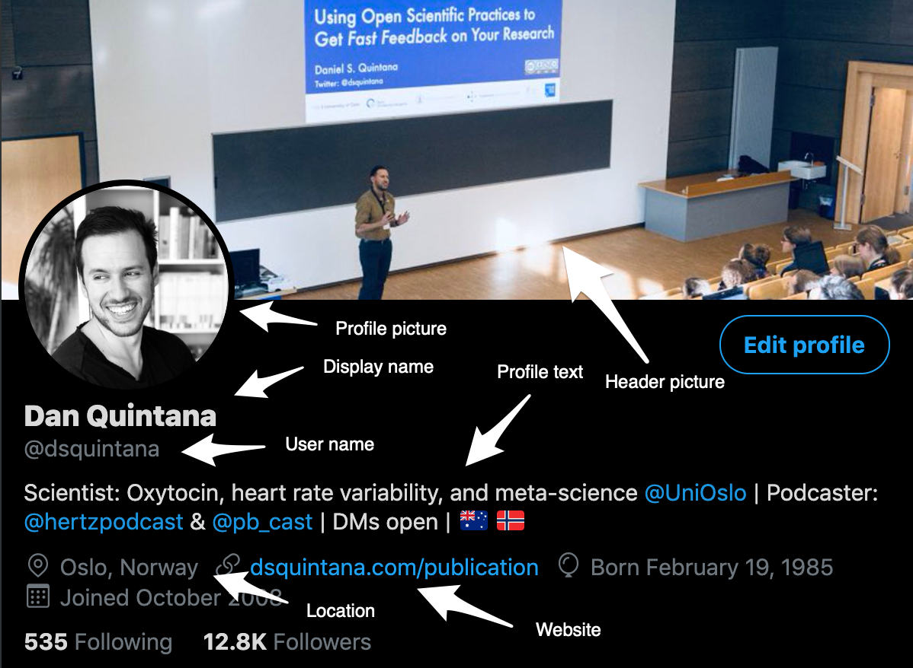
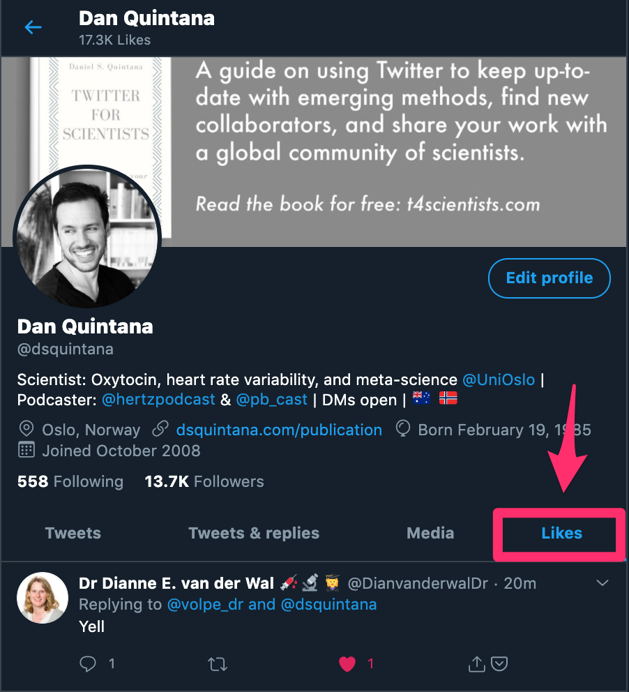
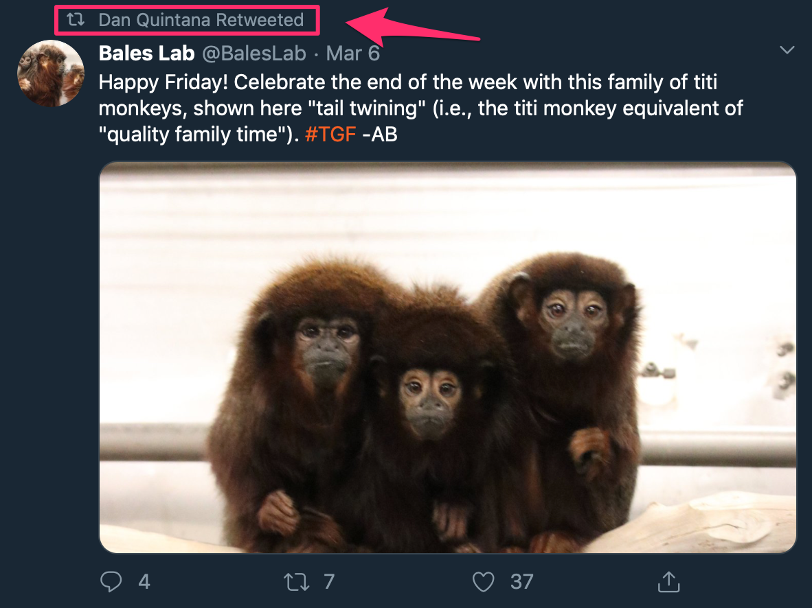
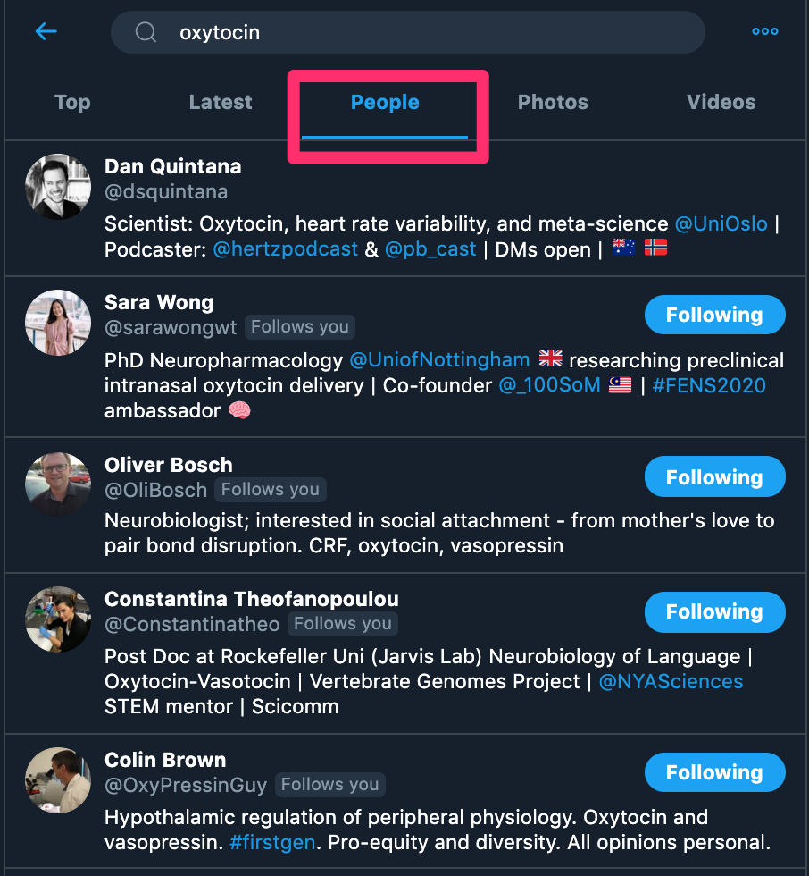

---
output:
  pdf_document: default
  html_document: default
---

```{r, include=FALSE}
options(tinytex.verbose = TRUE)
```

# Twitter for beginners {#beginner}

Twitter was originally conceived as a "micro-blogging" platform, in which users post short text updates. However, it later evolved into a social network where users interact with others. The core feature of this platform is that users share 280-character text posts, which can include links and other media (e.g., images and videos). It's also easy to add emoji, which can add some personality to your tweets.

## Setting up your Twitter profile {-#setting-up-your-twitter-profile}

After you've [signed up for an account on Twitter](https://twitter.com/), you should spend a few moments setting up your profile page. It's important you don't skip this step, as people will typically scan your profile page before they follow you to see if you'll be tweeting things that are relevant to their interests.

### Choosing your username {.unlisted .unnumbered}
If you're still hesitant about joining Twitter, sign up so that you can secure a good username, at the very least. The longer you wait before signing up, the less likely you can secure a username to your liking. I've spoken to many people, especially those with more common names, who regret not signing up earlier as they lost their chance for thier preferred username. If possible, try to avoid a long string of numbers at the end of your username, because these types of usernames are often associated with [bot accounts](https://en.wikipedia.org/wiki/Twitter_bot). 

If you can, pick a username that's close to your actual name, as this will make it easier for others to find you. Avoid a username that's associated with your current research area or institution---this might change in the future! Shorter names are also preferable, as these are easier for people to remember and count less towards twitter character limits when other people mention you in their tweets (more on this later in this chapter). All that to say, don't worry if all the possible permutations of your name are taken. You can still use any name that you like for your _display name_. When people see your tweets and your profile, they can see both your username and your display name.

```{r, fig.cap='The elements of a Twitter profile', echo=FALSE, fig.align='left', out.width='80%'}

```

### Your profile picture {.unlisted .unnumbered}

It's important that you change your profile picture to something different from the default profile picture, as this helps reassure others that you're not a bot and also helps people identify you. The most obvious picture to use is one of yourself, but this isn't necessary. You can use an image of anything you want, really. In fact, some scholars have become quite well known for their unconventional profile images.

```{r tweet-about-red-square, echo=FALSE}
tweetrmd::include_tweet("https://twitter.com/tom_hartley/status/659831072260141056")
```

It's fine to change your image every now and then, but don't do this *too* often as people may not easily recognize you when you tweet. Personally, I tend to identify tweets author via the profile image when scrolling through my Twitter feed, and I suspect others do the same.

You can use a JPEG or GIF file with a maximum size of 2MB. As Twitter is used on a range of devices with different screen sizes, Twitter recommends that profile photos are 400x400 pixels. But don't worry if your picture isn't exactly these dimensions.

### Your Twitter header image

This is another opportunity for people to get a sense of what to expect when they follow you. If you would like some inspiration, get a free [Canva](https://canva.com/) account and then search "Twitter Header" for some free design templates that use the required dimensions (1500 by 500 pixels). 

Another common header image is a landscape shot of the region where you live (or where you grew up). Two other popular options are an image of you giving a presentation, or an image of your latest publication. There aren't any specific rules here, but use the opportunity to share your personality or to give a preview of the sort of things that you'll tweet. Twitter also has its own [header image gallery](https://www.flickr.com/photos/twitteroffice/sets/72157643560484885/), with images that have the recommended dimensions. You can also find some great images on [Unsplash](https://unsplash.com), which you can use with or without attribution.

### Your bio

Share a short description of your research area and the sorts of thing that people can expect if they follow you. Bios are limited to 160 characters, which isn't a lot. You may also consider including the twitter handle of the institution you work at in your bio. 

Feel free to add emoji to give your bio a little more personality. This can give you a few extra characters that you can use. For example, you can also use emoji to highlight your research area. If you are a neuroscientists, say, you could use a brain emoji). 

### The website link

This is another good opportunity for people to learn about you. As an academic, people will be interested to find out about your publications and your current projects. I think every research scientist should have their own website, as people *will* Google you. You may miss out on opportunities, such as speaking invitations, if you don't have a website with your basic details. Many institutions provide staff and students with a profile page, but don't rely on this unless you have a permanent position. These institutional profile pages also tend to be quite inflexible regarding the kind of information that you can include. 

If you have some familiarity with R, I've put together an [easy-to-follow guide](https://www.dsquintana.blog/free-website-in-r-easy/) to make your own website for free. You can also use a Google Scholar profile, which you should set up if you haven't already.

### Location

It's up to you for how specific you want to be when it comes to specifying your location. Adding your city could be helpful, as people may want to contact and meet you in person if they're traveling through your region. In theory, you don't have to put a single physical location in this field, with some people using this space to include two cities if they regularly commute between them or they want to include their hometown. 

## The anatomy of a tweet {.unnumbered}

Tweets can include text (up to 280 characters), 1-4 images (PNG or JPG), a single GIF, or a video. You can also post both text (including emoji) and one of the types of media described above.

```{r, fig.cap='The "compose" window.', echo=FALSE, fig.align='left', out.width='80%'}
knitr::include_graphics('images/compose.jpg')
```

You can get pretty creative with emoji in your tweets.

```{r tweet-about-emojis, echo=FALSE}
tweetrmd::include_tweet("https://twitter.com/dsquintana/status/1198551316760543232")
```

### Using text in your tweets
Twitter was originally conceived as a SMS-based service, in which you could send text-only tweets via SMS.^[Believe it or not, this SMS tweet-feature [still exists](https://help.twitter.com/en/using-twitter/twitter-sms).] The majority of tweets are text only, so this is Twitter's bread and butter. 

Your text can also include website URLs. Regardless of the size of the URL, Twitter will treat each URL as 23 characters. You can also mention other Twitter users, by writing the '@' symbol, followed by their Twitter username, like this: \@dsquintana. When you use the @ symbol and start typing a name, Twitter will try and guess which account you want to write via an autocomplete function. People that you already follow will be at the top of the list. When you mention other twitter users in your tweets, they will receive a notification (unless they have this option turned off). 

### The types of images and videos you can include with your tweets

In terms of static images, you can upload JPG and PNG files. Adding images are a nice way to help make your tweets stand out in people's timelines. Static images can be up to 5MB in size.

If you're looking for images to illustrate a tweet, I recommend doing a search on [Unsplash](https://unsplash.com/), as you can use these high-quality images without attribution (but you can attribute the photographer if you like). Here's an example of the kind of image you can find on Unsplash.

```{r, fig.cap='I found this image on Unsplash by searching with the keyword "science"', echo=FALSE, fig.align='left', out.width='80%'}
knitr::include_graphics('images/unsplash.png')
```

You can also upload GIFs, which are animated images, and search for GIFs directly by clicking on the "GIF" symbol when composing a tweet. GIFs have become a very popular way to share moving images. You can also use GIFs as a replacement for more conventional videos. If you're adding GIFs from another source, there's a 15MB limit when uploading from your desktop (5MB if uploading via the Twitter mobile app).

Additionally, you can also upload conventional videos via the Twitter website. Videos cannot be longer than 2 minutes and 20 seconds or larger than 512MB. There are a number of additional limitations when uploading videos via the Twitter website that you should also [be aware of](https://help.twitter.com/en/using-twitter/twitter-videos). Uploading videos via the Twitter mobile app is less restrictive in terms of file formats, as you can upload both MOV and MP4 files. If you have a video that's longer than two minutes and twenty seconds, you can upload the video to YouTube and then tweet the link to the video. I would also recommend posting a short preview of your YouTube video, as I demonstrate in the [next chapter](#composing-tweets).

## Interacting with other tweets {.unnumbered}

When you see other tweets in your main feed, you can primarily interact with them three ways: liking, retweeting, and replying.

### Liking tweets

You can 'like' a tweet by clicking on the little heart icon. This acknowledges both to the tweet author and to other people that you liked the tweet (e.g. someone tweeted good news, an interesting article, or shared a funny meme). Liking can also be used as a token of support. For instance, if someone shares bad news, liking the tweet doesn't mean that you *like* the news. Rather, liking the tweet is a show of support for the person who sent the tweet.

Just keep in mind that when you like a tweet, this *might* appear in the feed of people that follow you, but probably won't. Also, others can quickly see which tweets you've liked via the "Likes" tab in your profile. 

```{r, fig.cap='The "Likes" column on your profile', echo=FALSE, fig.align='left', out.width='80%'}

```


You might also see tweets that people you follow have liked in your feed too. Liking is also a useful way of acknowledging that you've read a tweet that mentioned you when you don't have the time to reply or the tweet doesn't warrant a reply for one reason or another. Remember, you don't *have* to reply to someone who's mentioned you in a tweet, but it's good courtesy to do so^[Of course, this doesn't apply to harmful tweets. In section 5.3 I discuss how to block, mute, and report harmful tweets].

### Retweeting

If you come across a tweet that you think your followers would value, then you can use the Retweet function. When you click on the Retweet button, you'll get two options. The first option is a conventional retweet, which will appear in your follower's timeline, as if one of the users they follow tweeted it. Below is an example of a retweet. Your followers will see that you've retweeted someone else's tweet, like this.

```{r, fig.cap='A retweet example', echo=FALSE, fig.align='left', out.width='80%'}

```

The second option is to "Retweet with comment". This allows you to share the tweet, along with your comment above. This is a good way to describe *why* you're retweeting a particular tweet. 

```{r tweet-about-quote-RTs, echo=FALSE}
tweetrmd::include_tweet("https://twitter.com/dsquintana/status/1234385240711364608")
```

Here's another example of a retweet with a comment.

```{r tweet-about-quote-RTs-example2, echo=FALSE}
tweetrmd::include_tweet("https://twitter.com/ChelseaParlett/status/1234672017409896449")
```

Remember, if you want your followers to see a tweet in your timeline (e.g., a colleague announces a new paper), then you'll need to retweet it---only "liking" the tweet isn't enough. 

### Replying to tweets

One of the great things about Twitter is that it makes it much easier to chat with people that are otherwise difficult to contact via email. An email (usually) includes a salutation, some brief chit-chat, the actual question or comment, then a sign off. With twitter you just write the question or comment. In the following example, I'm replying to a tweet from [\@xieyihui](https://twitter.com/xieyihui), who quote-retweeted one of my tweets.

```{r tweet-about-reply, echo=FALSE}
tweetrmd::include_tweet("https://twitter.com/dsquintana/status/1235283618022518784")
```

Replying to tweets is one of the best ways to build your network, as it helps you to establish your expertise in your topic area. All the usual tweeting options are also available for replies.

## Direct messages {.unnumbered}

You can send a private direct message (often abbreviated as a "DM") to other Twitter users. This is a useful feature if you want to ask a question, but would rather the question wasn't public. But keep in mind that you can only send direct messages to people that are following you or people that have [opted in to recieve direct message from anyone](https://help.twitter.com/en/using-twitter/direct-messages#receive). I've decided to keep my direct messages open, so that anyone can contact me, but this is up to you. In addition, you can send group direct messages if you would like to privately chat in a group. 

If you want to get in contact with another scholar who's active on Twitter, a direct message is generally more effective than an email as there's much less friction writing a direct message. There's no need for long-winded formalities, formatting, or long email signatures. Just keep your message short if you're contacting someone you don't know for the first time. If your message doesn't fit on a smartphone screen, it's far too long.

## Your Twitter style {.unnumbered}

### How Personal should you tweets be?

This is up to you, so share whatever you're comfortable with. Some people like to keep their personal and academic lives separate, and others like to mix things up. One benefit of sharing some personal tweets is that it gives your Twitter account a little more personality, but don't feel that you *have* to do this.

### Finding your twitter "voice"

Be yourself. Trying to be someone you're not on Twitter is not sustainable in the long run. Another aspect to consider is how "professional" you want your Twitter account to be. Some people think that you shouldn't tweet anything you wouldn't say in front of a live audience of your peers. I understand this sentiment, and realize that different fields have different conventions. But at the same time, you also need to think about the *context* of Twitter, which is typically more casual than doing an academic talk. Just keep in mind that anyone can search through your tweets, if they want. Finally, some institutions have a social media policy, so it's best to check if your institution has one before you start tweeting.

### Using a pseudonym

Some scientists would prefer to not use their real identities on Twitter, for various reasons, and that's ok! While not using a real identity can limit *some* of the perks of Twitter (e.g., research collaborations), a pseudonymous user can still reap several benefits. But don't take it from me, here's [\@PsyBrief](https://twitter.com/PsyBrief), who used to have a pseudonymous account (but since identified himself), on what he had gotten out of Twitter while he was pseudonymous.

```{r tweet-about-pseudonym, echo=FALSE}
tweetrmd::include_tweet("https://twitter.com/PsyBrief/status/1232397281959104512")
```

## Finding people to follow {.unnumbered}

There are various ways to find people to follow on Twitter. Try searching for some key words of interest in [Twitter search](https://help.twitter.com/en/using-twitter/twitter-search), and have a look at the users behind these tweets. If you've found a few interesting accounts, have a look at who *they're* following. Over time, you'll find more accounts as you'll come across more retweets from accounts that you don't follow already.

If you click on the "People" tab when searching (see image below) this will show you accounts that have a specific keyword in their bio.

```{r, fig.cap='Searching for keywords in bios', echo=FALSE, fig.align='left', out.width='80%'}

```

You will also see a "Who to follow" box next to your main feed on the desktop site. These are *usually* good recommendations, but sometimes you get some odd suggestions. Either way, these recommended users are worth checking out from time to time. These recommendations are based on the accounts the people you are following are interacting with and following themselves.

If your bio and recent tweets align with the interests of the people you follow, they may follow you back. However, people aren't obligated to follow you back so don't expect this as a given.

Remember, you can always ["unfollow"](https://help.twitter.com/en/using-twitter/how-to-unfollow-on-twitter) people. Twitter __will not__ send people a notification if you unfollow them. Alternatively, you can also ["mute"](https://help.twitter.com/en/using-twitter/twitter-mute) people. This means that you're still following them, but their tweets won't appear in your feed.


