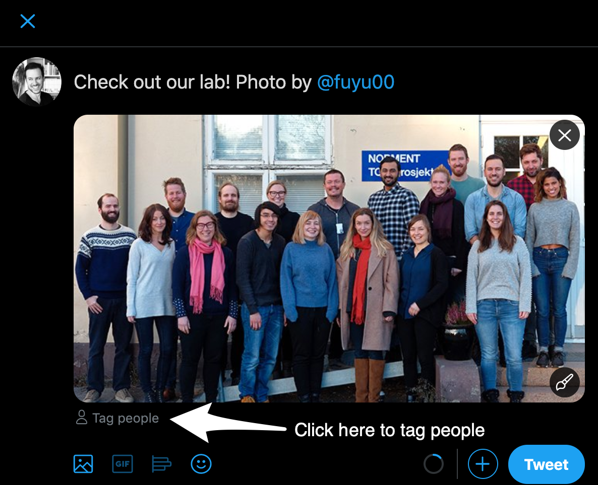

# Intermediate Twitter skills {#intermediate}

Here are a few ways that you can lift your Twitter game now that you've got some experience under your belt.

## Pinning a tweet to your profile

Once you've got more than about twenty tweets, you should 'pin' one of these tweets to the top of your profile. A pinned tweet will be the first tweet that someone sees when they visit your profile, so use this wisely. Here are some ideas of the types of tweets you should consider pinning to your profile:

- Your latest paper
- Your most important paper
- Information about an upcoming talk
- A summary of your current research project
- An announcement for research participant recruitment
- An image of you doing your job or a text tweet describing aspects of your work
- That you're looking for a new position

As for me, I tend to choose what is currently my most important paper. Pinned tweets continue to get likes and retweets long after you originally post them.

## Bookmarking tweets

While some people "like" tweets as a way to bookmark them for later use, Twitter has a specific bookmarking feature. Just click on the share button under a tweet, then click on "Add Tweet to Bookmarks", as [\@_DaniBeck](https://twitter.com/_DaniBeck) demonstrates here.

<blockquote class="twitter-tweet"><p lang="en" dir="ltr"><a href="https://twitter.com/hashtag/ScienceTwitter?src=hash&amp;ref_src=twsrc%5Etfw">#ScienceTwitter</a><br><br>Don&#39;t forget the usefulness of the BOOKMARK🔖option!<br><br>If you see someone post a good resource: bookmark it &amp; make your very own twitter depository🔖<br><br>👇🏾you see how to bookmark &amp; an example of my bookmarks; some great resources from <a href="https://twitter.com/dsquintana?ref_src=twsrc%5Etfw">@dsquintana</a>.<a href="https://twitter.com/AcademicChatter?ref_src=twsrc%5Etfw">@AcademicChatter</a> <a href="https://t.co/oAOoE4XnwB">pic.twitter.com/oAOoE4XnwB</a></p>&mdash; ᴅᴀɴɪ ʙᴇᴄᴋ ❼ (@_DaniBeck) <a href="https://twitter.com/_DaniBeck/status/1216742537844678657?ref_src=twsrc%5Etfw">January 13, 2020</a></blockquote> <script async src="https://platform.twitter.com/widgets.js" charset="utf-8"></script>

This is a handy feature for when you come across a tweet with a link to an interesting paper but you don't have the time now to read it that precise moment, for instance.

## Hashtags

These are useful for categorizing your tweets. One example of hashtag use is that they can organise communities of like-minded people. The \#PhDchat hashtag is a community of PhD students that often post questions and provide support for each other.

<blockquote class="twitter-tweet"><p lang="en" dir="ltr">The people who succeed are not those who never fail. The people who succeed are those who can move past failure and keep trying.<br><br>Also, the people around you are feeling just as intimidated and insecure as you are. <a href="https://twitter.com/hashtag/PhDchat?src=hash&amp;ref_src=twsrc%5Etfw">#PhDchat</a> <a href="https://t.co/lly5wgo2wl">https://t.co/lly5wgo2wl</a></p>&mdash; Jen Heemstra (@jenheemstra) <a href="https://twitter.com/jenheemstra/status/1232494183140745217?ref_src=twsrc%5Etfw">February 26, 2020</a></blockquote> <script async src="https://platform.twitter.com/widgets.js" charset="utf-8"></script>

Hashtags are also useful for organising tweets related to a specific event, like a conference. Many conferences now announce their 'official' hashtag that should be used for tweets related to the conference. For many conferences, there are a lot of interesting conversations happening on Twitter, so make use of the conference hashtag by following it and posting your thoughts using the hashtag.

<blockquote class="twitter-tweet"><p lang="en" dir="ltr">2009: The REAL conference is at the bar <br><br>2019: The REAL conference is on twitter</p>&mdash; Dan Quintana (@dsquintana) <a href="https://twitter.com/dsquintana/status/1104301358885281792?ref_src=twsrc%5Etfw">March 9, 2019</a></blockquote> <script async src="https://platform.twitter.com/widgets.js" charset="utf-8"></script>

You can also use hashtags in your profile bio, which were mentioned in [Chapter 1](#beginner), like [\@ChelseaParlett](https://twitter.com/@ChelseaParlett).


```{r,echo=FALSE, fig.align='left', out.width='80%'}

```


By doing this, Chelsea's profile will appear when people search for the hashtags that she has included.

## Images

When you post your images, you can tag Twitter usernames in your images. After adding your image, click on "Tag people".

```{r, fig.cap='Tagging users in photos.', echo=FALSE, fig.align='left', out.width='80%'}

```

Tagging photos has a few advantages. First, it saves you a few characters in your tweet as you tag people in the photo instead. Anyone that you tag will be notified that they've been included in a photo. You don’t have to use this feature for only tagging pictures of people. For example, you can post a screenshot of the abstract of a new paper and tag the co-authors of your paper.

## Twitter polls

If you're reading this, you're probably a scientist, so you should understand that Twitter polls are by no means scientific. However, they still provide *some* information and provide a fun alternative to typical text tweets.

```{r, fig.cap='A twitter poll', echo=FALSE, fig.align='center', out.width='80%'}
knitr::include_graphics('images/poll.png')
```

To improve data quality, people sometimes include a “Show me the data” option. This means that people can still see the results without swaying the vote with inaccurate data. You can also set how long the poll should run for. You will get a notification once the poll has closed, so that you can see the final results.

Polls can sometimes start an interesting discussion around the subject of the poll, so consider using this as a conversation starter. 

## Notifications

If you're easily distracted, I would consider [editing your notification settings](https://help.twitter.com/en/managing-your-account/notifications-on-mobile-devices) or turning then off altogether. It's nice to get that little buzz on your phone or the little red dot on your Twitter browser [favicon](https://en.wikipedia.org/wiki/Favicon), but every littnotificationck of y up over the day. If you're easily distracted by thintter, check out some of the tools mentioned in [Chapter 5](#care).

## Lists

With [Twitter lists](https://help.twitter.com/en/using-twitter/twitter-lists), you can create unique feeds that *only* contain specific groups of Twitter accounts. This is a useful way of filtering your general feed, which can get quite busy once you start following more than a couple of hundred accounts. You can also subsribe to other user's curated lists. 

Here are a few list suggestions if you'd like to make your own:

- Your collaborators
- People in your institution or lab
- Journals and preprint servers
- Scientists that tweet about specific topics (e.g., statistics)
- Non-science interests (e.g., music)
- Accounts that make you laugh 

These lists can either be public or private, and you don't have to be following accounts that you've added to your list.