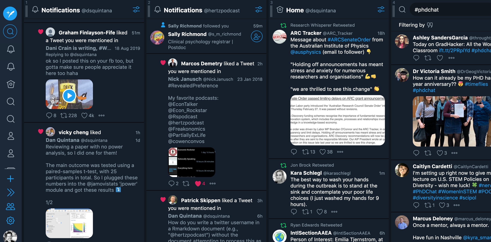

# Advanced Twitter skills {#advanced}

## Twitter threads {.unnumbered}

You can’t say a lot in a 280-character tweet, but you *can* with a Twitter thread, which connects a series of tweets. In principle, there is no limit to how many tweets can go in a thread; however, Twitter will only let you post 20 consecutive tweets in a single instance.  I think this is a sensible limit for a thread, but you can always add additional tweets after you’ve posted your first 20, if you like.

One benefit of using the Twitter app on your smartphone is that you can save your tweets as drafts---this includes threads as well. So, this means that you don't have to write a thread in a single sitting. Simply select "Cancel" when writing a tweet, then select "Save draft".

### Using a twitter thread to announce a new paper

Threads are a great way to announce a new paper, as you can say much more than if you were posting a single tweet. I think threads are a much better way to announce your new papers than a blog post, because they're quicker to write and are more likely to be shared. Unless you add an approximate reading time for your blog posts, people don't know what to expect when they see a link to a blog post in Twitter. But threads are typically no longer than 20 tweets (and usually shorter), so people are more likely to start reading. In addition, you never know which tweet in your thread people will find particularly interesting. If you have a 20-tweet thread, then you have 20 tweets that can be potentially retweeted. 

For more on why you should write threads, check out this thread.

```{r tweet-why-thread, echo=FALSE}
tweetrmd::include_tweet("https://twitter.com/dsquintana/status/1107939982361153537")
```

#### How to write a thread 

Here I've selected ten tweets out of a twenty-five-tweet thread I used to summarise a new paper. 

Let's start with the first tweet. This is the introduction, which includes a link to the actual paper and four images from the paper.  I also tagged the journal, so that they could be notified of the tweet and hopefully retweet it from their account. I also note that this is a thread, at the bottom of the tweet, so that readers know what to expect.


```{r tweet-thread1, echo=FALSE}
tweetrmd::include_tweet("https://twitter.com/dsquintana/status/1093814606441648128")
```

The next tweet gives a little context as to why I did the study. I added a striking image and a link to the paper it’s from if people want to read more.


```{r tweet-thread2, echo=FALSE}
tweetrmd::include_tweet("https://twitter.com/dsquintana/status/1093814618357673984",
                        hide_thread = TRUE)
```


This tweet explains the story behind the paper idea and acknowledges the team behind the project. I also tag the source of the dataset that I used and my co-authors.


```{r tweet-thread3, echo=FALSE}
tweetrmd::include_tweet("https://twitter.com/dsquintana/status/1093814657742262272",
                        hide_thread = TRUE)
```

This tweet covers some of the methods for our analysis.


```{r tweet-thread4, echo=FALSE}
tweetrmd::include_tweet("https://twitter.com/dsquintana/status/1093814664771837953",
                        hide_thread = TRUE)
```

These two tweets describe some of the results of the paper, via some figures from the paper.


```{r tweet-thread5, echo=FALSE}
tweetrmd::include_tweet("https://twitter.com/dsquintana/status/1093814684262821889",
                        hide_thread = FALSE)
```

These two tweets describe some of our methods, including a link to the tool I used (i.e., NeuroSynth) and the paper describing this tool.


```{r tweet-thread6, echo=FALSE}
tweetrmd::include_tweet("https://twitter.com/dsquintana/status/1093814750855815169",
                        hide_thread = FALSE)
```

In this tweet, I acknowledge my inspiration for the study in the first place, to give a little more context.


```{r tweet-thread7, echo=FALSE}
tweetrmd::include_tweet("https://twitter.com/dsquintana/status/1093814801636184065",
                        hide_thread = TRUE)
```

Finally, I provide a summary and I thank my team again (this paper was *truly* a team effort).


```{r tweet-thread8, echo=FALSE}
tweetrmd::include_tweet("https://twitter.com/dsquintana/status/1093814804949729281",
                        hide_thread = TRUE)
```

Before moving to the next section, here's a final tip for your threads: To increase the chances that people will share more individual tweets from your threads, do your best to write each tweet so that it can stand together on its own.


## Going viral {.unnumbered}

It's almost impossible to predict which tweets will go viral, so don't spend time trying to make a viral tweet. I made the following tweet on a whim, thinking a few psychological scientists who are familiar with the [rabbit-duck illusion](https://en.wikipedia.org/wiki/Rabbit%E2%80%93duck_illusion) would find this funny. I was spectacularly wrong.


```{r tweet-viral, echo=FALSE}
tweetrmd::include_tweet("https://twitter.com/dsquintana/status/1163083819605475328")
```


While viral tweets have the upside of getting you a few more followers, Twitter will be essentially unusable for you during this period, as your notifications will be __flooded__. It's typically tweets that cover general topics that go viral, so you probably won't gain many new followers who are actually interested in your science---but if you're lucky you might get a few. I have found that the further your tweet travels outside of your network, the more *unusual* the responses. You may also get a few nasty tweets as well, which I cover in the [next chapter](#care).

## Making your own GIFs {.unnumbered}

GIFs get a lot of attention. For instance, instead of just posting a static image of your paper, you can create a GIF that scrolls through your paper. Of course, you could post this as a video, but people often expect audio when they come across a video. GIFs don't have audio and continually loop. There is a huge library of GIFs online and you can also [search for GIFs](https://help.twitter.com/en/using-twitter/tweeting-gifs-and-pictures) directly in Twitter when composing a tweet.

If you would like to make GIFs on your desktop, I recommend the [GIF Brewery app](https://gfycat.com/gifbrewery) (Mac only), as this gives you lots of options for making GIFs. For your smartphone, I recommend [ImgPlay](https://imgplay.net/) (iOS and Android). The best part of this app is that you can squeeze the size of your GIFs to under the 5MB Twitter limit. You can't do this with GIF Brewery app, and you'll have to sometimes play around with the settings to get your GIF under the 5MB limit.

## Getting your tweet back in the feed again {.unnumbered}

No matter where you are in the world, some of your followers will be asleep when you tweet. This means that they might miss your tweet. Don't think too much about "timing" your tweets. However, if you've tweeted something important, like a new paper, there are ways to "re-introduce" your tweets to your user's feeds.

__1. Retweeting your original tweet.__ I would keep this to minimum, as this is the digital equivalent of patting yourself on the back, but this is fine occasionally.

__2. Replying to your own tweet with a tweet containing additional information.__ By doing this, your followers will see your original tweet (despite the fact it was tweeted in the past) and the new tweet.

## Sharing your replies {.unnumbered}

If you've written a reply to someone's tweet, the only time it will appear in someone else's feed is if they follow both you and the person you replied to, or if the twitter algorithm somehow pushes this tweet into people's feed if it's produced a lot of likes or retweets. However, if you want more people to see it, you can retweet that particular reply tweet. 

## Analytics {.unnumbered}

With the analytics feature, you can see how your individual tweets are performing in terms of impressions (i.e., how many people saw your tweet) and engagements (i.e., How people interacted with your tweet). Here's an example of the types of engagement you can measure.

```{r, fig.cap='Using the analytics feature to understand how people are engaging with your tweets', echo=FALSE, fig.align='left', out.width='80%'}
knitr::include_graphics('images/analytics.png')
```

You shouldn't get too hung up on these numbers, but you can use them as a guide for how people are interacting with your tweets. For instance, you might learn that many people are clicking on the links that you share in your tweets. Or perhaps they're clicking more on the images that you're sharing. 

## The Tweetdeck app {.unnumbered}

This [web app](https://tweetdeck.com/), which can also be downloaded as a [Mac app](https://itunes.apple.com/gb/app/tweetdeck-by-twitter/id485812721?mt=12), is Twitter on steroids. You can customise this app with different columns, which can contain your main feed, the feed of a specific user (including yourself), notifications, a specific search term, the tweets you've liked, and your messages. 

```{r, fig.cap='Tweetdeck set up with four columns. Note that the fourth column is for keeping track of the PhDChat hashtag', echo=FALSE, fig.align='left', out.width='80%'}

```

Tweetdeck can be particularly useful if you have more than one twitter account (e.g., your individual account and an account for your lab) of if you're following a specific hashtag or search term. You can create a column with any lists that you've put together, which I covered in the [previous chapter](#intermediate).

But I should warn you, this app can be very addictive because it can show you multiple streams of new information.

## Curating your lab's Twitter account {.unnumbered}

Having a Twitter account for your lab is a useful way to highlight all the research from your group. It's also a great opportunity to give some exposure to members of your lab, by retweeting their tweets and tagging their usernames. Some labs rotate the curator from week-to-week between lab members, like [\@BalesLab](https://twitter.com/BalesLab).


```{r tweet-lab, echo=FALSE}
tweetrmd::include_tweet("https://twitter.com/BalesLab/status/1235612141673037826")
```


Notice that the tweet is signed off with the initials "AB". This is to indicate that the tweet was written by [\@Alexer_Baxter](https://twitter.com/Alexer_Baxter) who is curating the account for the week. This particular tweet is a great example of using a hashtag meme (\#ThrowbackThursday, in which you post a photo from the past) to highlight your work. 

It's also a good idea to introduce the curator and to pin this introduction to your lab's Twitter profile, as discussed in the [previous chapter](#intermediate).


```{r tweet-curator, echo=FALSE}
tweetrmd::include_tweet("https://twitter.com/BalesLab/status/1234549334827393024")
```

## Highlighting your work on other platforms {.unnumbered}

Twitter's popularity is not going to last forever (remember MySpace?). It's hard to predict the next big social media platform, but it's either going to be predominantly driven by text, video, or audio. If it’s text-based platform, then by getting involved with Twitter *now*, you’ll get valuable experience. If you don't want to get involved on Twitter because it's a fad, you'll never get involved on *any* network---they're all fads in the long run. However, if the next big thing is audio or video, then you can use Twitter to highlight your posts on these types of networks.

### Video
YouTube is a natural home for any videos you may have of presentations. It's fairly straightforward to save a video of any online presentations that you give via Zoom or Microsoft Teams (just ask for people's permission to record and share beforehand in case they appear in the video). 

Even if you don't use YouTube, this is the first point of call for millions of other people when they're wanting to learn about a new topic.

### Audio

Podcasts have been steadily growing in popularity. While it's relatively straightforward to start your own podcast for very little money (see my [step-by-step guide](https://www.dsquintana.blog/podcast-guide/)), it can be hard for other people to find your podcast on the popular podcast directories. To combat this discovery problem, you can post previews of your podcasts and links to episodes on Twitter.


```{r tweet-audio, echo=FALSE}
tweetrmd::include_tweet("https://twitter.com/hertzpodcast/status/1234383454198018052")
```

Twitter doesn't automatically lend itself to sharing audio, but you can [create an audiogram and transribe the audio](https://www.dsquintana.blog/podcast-guide/) (as the above clip) for easier sharing. 

Twitter is also slowly rolling out an audio tweet feature.

```{r tweet-audio-feature, echo=FALSE}
tweetrmd::include_tweet("https://twitter.com/dsquintana/status/1279463590102274049")
```

As of writing, this feature is only available via the iOS Twitter app for limited accounts.


