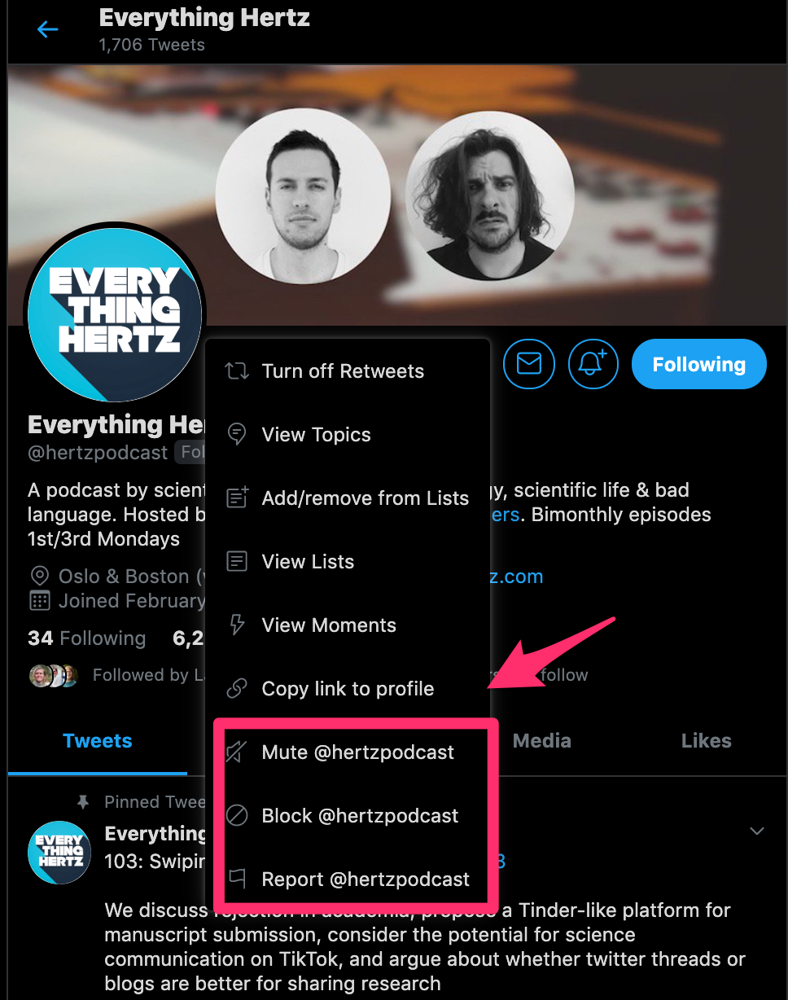

# Taking care of yourself on Twitter{#care}

So far, I've covered all the benefits of Twitter. However, not everyone always has a positive experience on the platform. There are three main potential downsides to Twitter that I'm going to cover in this section. 

## Annoying topics (or users) clogging your feed 

There might be some situations where people are tweeting a lot about a particular topic that you're not interested, such as when they're tweeting updates from a conference outside of your field. In these situations, you can mute specific users so they don't appear in your feed. They won't know that you've muted them and you're still following them. You can do this by clicking on the "more" button (the circle with three open circles) on a user's profile (Figure \@ref(fig:mute)).

```{r mute, fig.cap='Muting a user', echo=FALSE, fig.align='center', out.width='80%'}

```

You can also mute specific topics appearing in your timeline, for a set period of time (or forever) by adjusting your settings (Figure \@ref(fig:mute-word)).

```{r mute-word, fig.cap='Muting a keyword', echo=FALSE, fig.align='center', out.width='80%'}
knitr::include_graphics('images/mute_word.png')
```

## Spending too much time on Twitter

Twitter is designed to hold your attention for as long as possible, so it's no surprise that it can become addictive. The constant flow of new information and the intermittent reward of likes, retweets, and new followers makes it _really easy_ to get hooked. It wouldn't be this popular if it wasn't fun. This can become a problem, because if you're spending all your time on the platform then you'll have no work to share.

If you're like me, and you sometimes can't resist checking Twitter whenever you have a spare moment, there are desktop apps available, like [*SelfControl*](https://selfcontrolapp.com/) (MacOS) and [*Cold Turkey*](https://getcoldturkey.com/) (MacOS and Windows), which can block distracting websites. You may want to set this for smaller blocks or for entire days. Personally, I work in periods of forty minutes, in which I block all distracting websites. I take a 10-20 minute break between work sessions, and that's when I usually check Twitter.

It's fine if you want to take a break from the platform from time-to-time. As for me, I have occasional periods where I delete the Twitter app from my phone. I do this if I either have a very tight deadline or if I notice that I've been using the plafrom too much. The [Screen Time](https://support.apple.com/en-us/HT208982) iOS app has been an eyeopener when it comes to my use. Don't let the reward of a couple more likes or followers overshadow lost hours of work. 

## Dealing with abusive or harmful tweets

While not everyone has experienced harmful tweets, it is important to acknowledge that there have been some cases of harassment and verbal abuse in the Twitter science community. This will probably not be a regular experience for you, but it *could* happen.

You can block accounts, which means they can't follow you or interact with you. Keep in mind that if they log out of their account which was blocked, they can see your tweets (if they're public). But they can no longer interact with you.

You can also report abusive or harmful tweets (or accounts) to Twitter, by following [these instructions](https://help.twitter.com/en/safety-and-security/report-abusive-behavior). 

In the end, your well-being is more important than potentially getting a few extra followers and retweets. Don't be shy with blocking and muting people if you have to.


