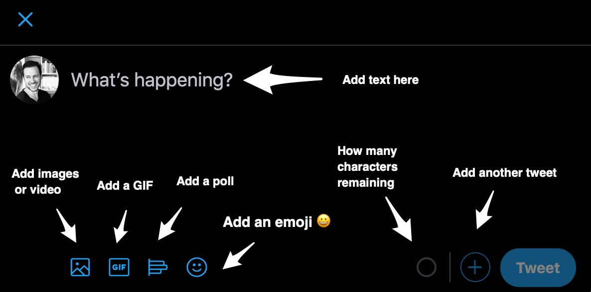
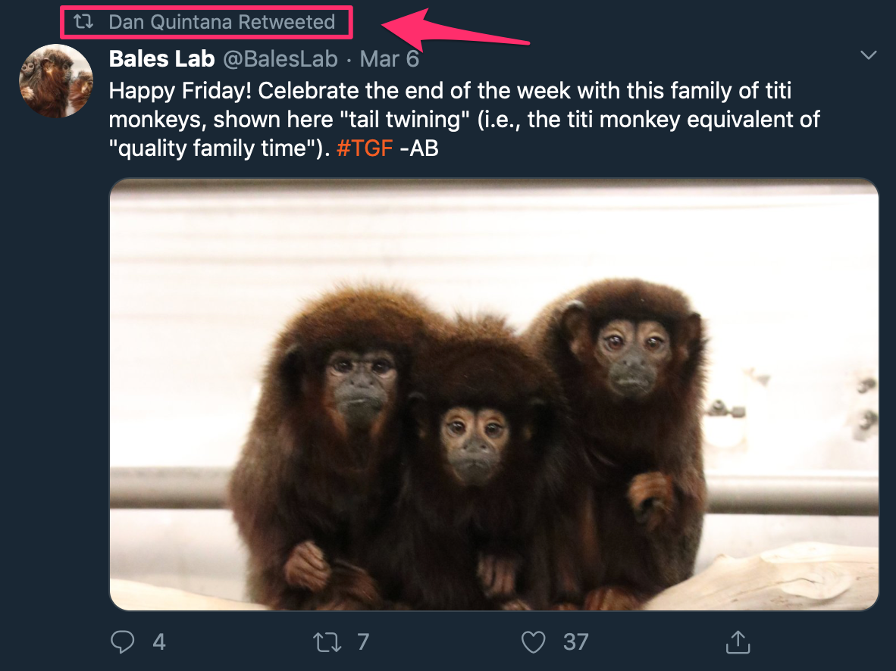

--- 
title: "Twitter for Scientists"
author: "Daniel S. Quintana"
date: "March 4, 2020 (version 0.1)"
site: bookdown::bookdown_site
documentclass: book
bibliography: [book.bib, packages.bib]
biblio-style: apalike
link-citations: yes
description: "A Twitter guide for scientists"
---

# Preface {-#preface}

<blockquote class="twitter-tweet"><p lang="en" dir="ltr">There are four ways to get your research known, but only only one of these is an option for every early career researcher: <br><br>1. Already be famous <br>2. Have a famous mentor <br>3. Repeatedly win the peer-review lottery<br>4. Actively contribute to social media</p>&mdash; Dan Quintana (@dsquintana) <a href="https://twitter.com/dsquintana/status/1105416818791993344?ref_src=twsrc%5Etfw">March 12, 2019</a></blockquote> <script async src="https://platform.twitter.com/widgets.js" charset="utf-8"></script>

I believe that Twitter can provide extraordinary opportunities for scientists, regardless of their seniority, mentors, or institution. By actively contributing to Twitter, I've kept up-to-date with emerging methods, several doors have opened for research collaborations, and I've been introduced to a supportive community of like-minded scientists. Most importantly, I've received valuable feedback on my work and been able share my research to people that would have not otherwise seen it. In fact, if it wasn't for Twitter I don't think I'd still be in academia. 

I often give talks on Twitter because I've seen how much it can give early career scientists a leg-up in their careers. However, I've found that these talks are better suited to explaining *why* scientists should get involved with social media, rather than *how* to do it. So that I can focus more on the *why* during these talks, I've wanted to refer audiences to resources on how to use Twitter. However, I haven't been able to find any single source that includes all the important information that I think scientists on Twitter need to know.

So that's why I've written this book. 

## A few comments about this book before we begin {-#a-few-comments-about-this-book-before-we-begin}

This book will walk you through the ins and outs of using Twitter, covering three levels: Beginner, Intermediate, and Advanced. Unless specified otherwise, I use the Twitter desktop browser website in my examples and instructions. There are a few small differences between using Twitter on your desktop browser and using the iOS or Android Twitter apps. However, these apps are similar enough for the instructions in this book to be transferable. It's also worth noting that while I've tried to make this guide applicable to research scientists across all fields, its written from my perspective as a scientist in the psychological and biomedical sciences, which means some of the examples I use and norms I mention might not be relevant for everyone. Use your best judgement and feel free to pick and choose from the examples I use and the advice given.

Twitter is a platform in flux. It didn't begin with retweets or images, let alone threads and GIFs, so some of the examples in this book may not be relevant in the future. New features are constantly tested in smaller worldwide markets. As I'm writing this, a separate ephemeral timeline, in which tweets disappear after 24 hours, has just been launched in Brazil as a test. This feature might be removed after a few weeks of testing, or could be available for everyone in the coming months. 

While it's difficult to predict what Twitter will look like in the future, the broad principles of the platform should remain similar. I will do my best to update this book in the future, in response to Twitter's updates and any changes in norms regarding how scientists use Twitter. 

The online version of this book is licensed under the [Creative Commons Attribution-NonCommercial-ShareAlike 4.0 International License](https://creativecommons.org/licenses/by-nc-sa/4.0/).

## About me {-#about-me}

I'm a research scientist at the University of Oslo, in the area of biological psychology. I was awarded my PhD in Psychology in 2013 at the University of Sydney. I now investigate how the hormone oxytocin influences how we think and feel. I'm also interested in cardiac psychophysiology and meta-science, which is the science of scientific practice. As this is a book about Twitter, you will not be surprised to read that I [tweet a fair bit](https://twitter.com/dsquintana).

I'm the co-host and producer of [*Everything Hertz*](https://everythinghertz.com/), which is a podcast about methodology and scientific life in the biobehavioral sciences. We talk a lot about Twitter on this show, and its role in scientific practice. Many of our episode topics are also inspired by discussions on Twitter.

I live on an island in the Oslo fjord with my wife and two daughters. 

<!--chapter:end:index.Rmd-->

# Twitter for beginners {#beginner}

Twitter was was originally conceived as a "micro-blogging" platform, in which users post short text updates. However, it later evolved into a social network where users interact with each other. The core of this platform is that users share 280-character text posts, which can include links and other media (e.g., images and videos). It's also easy to add emoji, which can add a little personality to your tweets.

## Setting up your Twitter profile

After you've [signed up for an account on Twitter](https://twitter.com/), you should spend a few moments setting up your profile page. This is important, as people will typically scan your profile page before they follow you to see if you'll be tweeting things that are relevant to their interests.

### Your username

If you're still hesitant about joining Twitter, sign up so that you can secure a good username, at the very least. The longer you wait before signing up, the less likely you can secure a username to your liking. If possible, try to avoid a long string of numbers at the end of your username, because these types of usernames are often associated with [bot accounts](https://en.wikipedia.org/wiki/Twitter_bot). 

If you can, pick a username that's close to your actual name, as this will make it easier for others to find you. Avoid a username that's something associated with your current research area---this might change in the future! Shorter names are also preferable, as these are easier for people to remember and count less towards twitter character limits when other people mention you in their tweets (more on this later in this chapter). All that to say, don't worry if all the possible permutations of your name are taken. You can still use any name that you like for your _display name_. When people see your tweets and your profile, they can see your username and your display name.

```{r, fig.cap='The elements of a Twitter profile', echo=FALSE, fig.align='left', out.width='80%'}
knitr::include_graphics('images/profile.png')
```

### Your profile picture

It's important that you change your profile picture to something different from the default profile picture, as this helps reassure others that you're not a bot and also helps people identify you. The most obvious picture to use is one of yourself, but this isn't necessary. It's fine to change your image every now and then, but don't do this *too* often as people may not easily recognize you when you tweet.

You can use a JPEG or GIF file with a maximum size of 2MB. As Twitter is used on a range of devices with different screen sizes, Twitter recommends that profile photos are 400x400 pixels.

### Your Twitter header image

This is another opportunity for people to get a sense of what to expect when they follow you. If you would like some inspiration, get a free [Canva](https://canva.com/) account and then search "Twitter Header" for some free design templates that use the required dimensions (1500 by 500 pixels). 

Another common header image as a landscape shot of the region where you live (or where you grew up). Two other popular options are an image of you giving a presentation, or an image of your latest publication. There aren't any specific rules here, but use the opportunity to share your personality or to give a preview of the sort of things that you'll tweet. Twitter also has its own [header image gallery](https://www.flickr.com/photos/twitteroffice/sets/72157643560484885/), with images, which  use the recommended dimensions.

### Your bio

Share a short description of your research area and the sort of thing that people can expect if they follow you. These are limited to 160 characters, which isn't a lot. You may also consider including the twitter handle of the institution you work at in your bio. 

Feel free to add emoji to give your bio a little more personality. This  can give you a few extra characters that you can use. For instance, rather than saying you're Australian, you can include an emoji of the Australian flag  🇦🇺, which saves you a handful of characters. You can also use emoji to highlight your research area (e.g, a neuroscientist can use a brain emoji 🧠). 

### The website link

This is another good opportunity for people to learn about you. As an academic, people want to find out about your publications and your current projects. I think every research scientist should have their own website, as people *will* Google you. If you have a basic familiarity with R, I've put together an [easy-to-follow guide](https://www.dsquintana.blog/free-website-in-r-easy/) to make your own website for free. Other options include your institutional website, or your Google Scholar profile.

### Location

It's up to you for how specific you want to be when it comes to your location. Adding your city could be helpful, as people may want to contact and meet you in person if they're travelling through your town. In theory, you don't have to put a single physical location in this field, with some people using this space to include two cities if they regularly commute between them or they want to include their hometown.

## The anatomy of a tweet

Tweets can include text (up to 280 characters), 1-4 images (PNG or JPG), a single GIF, or a video. You can also post both text (including emoji) and one of the types of media described above.

```{r, fig.cap='The "compose" window.', echo=FALSE, fig.align='left', out.width='80%'}

```

You can get pretty creative with emoji in your tweets.

<blockquote class="twitter-tweet"><p lang="en" dir="ltr">Your audience when giving a talk: <br><br>🙂🙂🙂😀🧐😀😀😏😀🤓😃😀😀😊😀😊🙂🙂😀🙂😀😴🙂😀🙂😀🙂😐🙂🙂😀🙂🙂🙂😀🙂😀🙂😀<br><br>What you see when giving a talk: <br><br>😐😴😐😴😴😐😐😐😴😴😐😐😴😐😴😴😴😴😐😐😴😴😴😴😐😐😴🤔😴😴😴😐😐😴😐😴😴😐😐</p>&mdash; Dan Quintana (@dsquintana) <a href="https://twitter.com/dsquintana/status/1198551316760543232?ref_src=twsrc%5Etfw">November 24, 2019</a></blockquote> <script async src="https://platform.twitter.com/widgets.js" charset="utf-8"></script>


### Using text in your tweets
Twitter was originally conceived as a SMS-based service, in which you could send text-only tweets via SMS.^[Believe it or not, this SMS tweet-feature [still exists](https://help.twitter.com/en/using-twitter/twitter-sms).] The majority of tweets are text only, so this is Twitter's bread and butter. 

Your text you can also include website URLs. Regardless of the size of the URL, Twitter will treat each URL as 23 characters. You can also mention other Twitter users, by writing the '@' symbol, followed by their twitter username, like this: \@dsquintana. When you mention other people in your tweets, they will be notified. 

### The types of images and videos you can include with your tweets

In terms of static images, you can upload JPG and PNG files. Adding images are a nice way to help make your tweets stand out. Static images can be up to 5MB in size.

If you're looking for images to illustrate a tweet, I recommend doing a search on [Unsplash](https://unsplash.com/), as you can use these high-quality images without attribution (but you can attribute the photographer if you like). Here's an example of the kind of image you can find on Unsplash.

```{r, fig.cap='I found this image on Unsplash by searching with the keyword "science"', echo=FALSE, fig.align='left', out.width='80%'}
knitr::include_graphics('images/unsplash.png')
```

You can also upload GIFs, which are animated images, and search for GIFs directy by clicking on the "GIF" symbol when composing a tweet. GIFs have become a very popular way to share moving images. You can also use GIFs as a replacement for more conventional videos. If you're adding GIFs from another source, there's a 15MB limit when uploading from your desktop (5MB if uploading via the Twitter mobile app).

Additionally, you can also upload conventional videos via the Twitter website. Videos cannot be longer than 2 minutes and 20 seconds or larger than 512MB. There are a number of additional limitations when uploading videos via the Twitter website that you should also [be aware of](https://help.twitter.com/en/using-twitter/twitter-videos). Uploading videos via the Twitter mobile app is less restrictive in terms of file formats, as you can upload both MOV and MP4 files. If you have video that's longer than two minutes and twenty seconds, you can upload the video to YouTube and then tweet the link to the video. I would also recommend posting a short preview of your YouTube video, as I demonstrate in the [next chapter](#composing-tweets).

## Interacting with other tweets

When you see other tweets in your main feed, you can primarily interact with them three ways: liking, retweeting, and replying.

### Liking tweets

You can 'like' a tweet by clicking on the little heart. This acknowledges both the to tweet author and to other people that you liked the tweet (e.g. someone tweeted good news, and interesting article, or shared a funny meme). Liking can also be used as a token of support. For instance, if someone shares bad news, liking the tweet doesn't mean that you like the news. Rather, liking the tweet is a show of support for the person who sent the tweet.

Just keep in mind that when you like a tweet, this *might* appear in the feed of people that follow you. You might also see tweets that people you follow have liked in your feed too. Liking is also a useful way of acknowledging that you've read a tweet that mentioned you. 

### Retweeting

If you come across a tweet that you think your followers would like, then you can use the Retweet function. When you click on the Retweet button, you'll get two options. The first option is a conventional retweet, which will appear in your follower's timeline, as if one of the users they follow tweeted it. Below is an example of a retweet. Your followers will see that you've retweeted someone else's tweet (but they'll see your name rather than "You").

```{r, fig.cap='A retweet example', echo=FALSE, fig.align='left', out.width='80%'}

```

The second option is to "Retweet with comment". This allows you to share the tweet, along with your comment above. This is a good way to describe *why* you're retweeting a particular tweet. 

<blockquote class="twitter-tweet"><p lang="en" dir="ltr">If you&#39;re interested in science communication this episode is for you ⤵️ <a href="https://twitter.com/hashtag/TeamTwitterThread?src=hash&amp;ref_src=twsrc%5Etfw">#TeamTwitterThread</a> <a href="https://t.co/rknRa0Al7Z">https://t.co/rknRa0Al7Z</a></p>&mdash; Dan Quintana (@dsquintana) <a href="https://twitter.com/dsquintana/status/1234385240711364608?ref_src=twsrc%5Etfw">March 2, 2020</a></blockquote> <script async src="https://platform.twitter.com/widgets.js" charset="utf-8"></script>

Here's another example of a retweet with a comment.

<blockquote class="twitter-tweet"><p lang="en" dir="ltr">When you think you recognize someone from Twitter, but you&#39;re not sure and you don&#39;t want to be awkward about it. <a href="https://t.co/wK1aavuBNz">https://t.co/wK1aavuBNz</a></p>&mdash; Chelsea Parlett-Pelleriti (@ChelseaParlett) <a href="https://twitter.com/ChelseaParlett/status/1234672017409896449?ref_src=twsrc%5Etfw">March 3, 2020</a></blockquote> <script async src="https://platform.twitter.com/widgets.js" charset="utf-8"></script>

### Replying to tweets

One of the great things about Twitter is that it makes it much easier to chat with people that can otherwise be difficult to contact via email. An email (usually) includes a salutation, some brief chit-chat, the actual question or comment, then a sign off. With twitter you just write the question or comment. In the following example, I'm replying to a tweet from [\@xieyihui](https://twitter.com/xieyihui), who quote-retweeted one of my tweets.

<blockquote class="twitter-tweet"><p lang="en" dir="ltr">You&#39;ve read my mind 😎 I hope to do one after I&#39;ve had a little more experience with the package. I hadn&#39;t realised until using it how useful bookdown could be for technical documents!</p>&mdash; Dan Quintana (@dsquintana) <a href="https://twitter.com/dsquintana/status/1235283618022518784?ref_src=twsrc%5Etfw">March 4, 2020</a></blockquote> <script async src="https://platform.twitter.com/widgets.js" charset="utf-8"></script>

Replying to tweets is one of the best ways to build your network, as it helps you to establish your expertise in your topic area. All the usual tweeting options are also available for replies.

## Direct messages

You can send a private direct message (often abbreviated as a "DM") to other Twitter users. This is a useful feature if you want to ask a question, but would rather the question wasn't public. But keep in mind that you can only send direct messages to people that are following you or people that have [opted in to recieve direct message from anyone](https://help.twitter.com/en/using-twitter/direct-messages#receive). I've decided to keep my direct messages open, so that anyone can contact me, but this is up to you. In addition, you can send group direct messages if you would like to privately chat in a group. 

Just be a little wary when sending direct messages, as people have sometimes mistaken a private direct message reply for a public tweet reply and tweetied something embarrassing. You have been warned.

## Your Twitter style

### How personal should you tweets be?

This is up to you, so share whatever you're comfortable with. Some people like to keep their personal and academic lives separate, and others like to mix things up. One benefit of sharing some personal tweets is that it gives your Twitter account a little more personality, but don't feel that you *have* to do this.

### Finding your twitter "voice"

Be yourself. Trying to be someone you're not on Twitter is not unsustainable in the long run. Another aspect to consider is how "professional" you want your Twitter account to be. Some people think that you shouldn't tweet anything you wouldn't say in front of a live audience of your peers. I understand this sentiment, and realize that different fields have different conventions. But at the same time, you also need to think about the *context* of Twitter, which is typically more casual than doing an academic talk. Just keep in mind that anyone can search through your tweets, if they want. Finally, some institutions have a social media policy, so it's best to check if your institution has one before you start tweeting.

### Using a pseudonym

Some scientists would prefer to not use their real identities on Twitter, for various reasons, and that's ok! While not using a real identity can limit *some* of the perks of Twitter (e.g., research collaborations), a pseudonymous user can still reap several benefits. But don't take it from me, here's [\@PsychBrief](https://twitter.com/PsychBrief), a pseudonymous account, on what they've gotten out of Twitter.

<blockquote class="twitter-tweet" data-conversation="none"><p lang="en" dir="ltr">I credit twitter completely for my understanding of statistics, research methods, metascience. I might have found out about some of these things without it but it massively accelerated the process. Agree, it&#39;s a very useful way to find new people and learn more.</p>&mdash; PsychBrief (@PsyBrief) <a href="https://twitter.com/PsyBrief/status/1232397281959104512?ref_src=twsrc%5Etfw">February 25, 2020</a></blockquote> <script async src="https://platform.twitter.com/widgets.js" charset="utf-8"></script>

## Finding people to follow

There are various ways to find people to follow on Twitter. Try searching for some key words of interest in [Twitter search](https://help.twitter.com/en/using-twitter/twitter-search), and have a look at the users behind these tweets. If you've found a few interesting accounts, have a look at who *they're* following. Over time, you'll find more accounts as you'll come across more retweets from accounts that you don't follow already.

You will also see a "Who to follow" box next to your main feed on the desktop site. These are *usually* good recommendations, but sometimes you get some odd suggestions. Either way, these recommended users are worth checking out from time to time. These recommendations are based on the accounts the people you are following are interacting with and following themselves.

Remember, you can always ["unfollow"](https://help.twitter.com/en/using-twitter/how-to-unfollow-on-twitter) people. Twitter __will not__ send people a notification if you unfollow them. Alternatively, you can also ["mute"](https://help.twitter.com/en/using-twitter/twitter-mute) people. This means that you're still following them, but their tweets won't appear in your feed.

<!--chapter:end:01-intro.Rmd-->

# Composing tweets

The most common question I get at social media workshops that I've run is, "What should I tweet?". There is no easy answer to this, because every researcher and their subfield is different. But regardless of your subfield, _the best way to engage your followers is to either entertain or educate_. In other words, you should aim to help people either pass time or save time. Being entertaining doesn't come naturally to most people, so don't worry if this isn't you. But as a scientist, you are very well-placed to educate, no matter your level of training.

Thanks to [Chapter 1](#beginner), you're up to speed with the general mechanics of Twitter. You also just learnt about the "entertain or educate" principle, with *any* scientist ready to educate. But even at when getting to this point, many scientists hit a wall, because they believe they can only tweet the finished product of thier work, which is typically papers. But as soon as you realise that the *process* of your work is just as interesting than as the *output*, then things become much easier. You're going to see a few examples of this below.

When it comes to tweet frequency, it's hard to give any firm recommendations. Whether you're tweeting too much depends on how many people your followers are following, and how much *they* tweet. So, this means that the "too much" threshold is different for everyone. In my opinion, I think it's fairly difficult to tweet too much. In the early days of Twitter (or any social network), where users didn't follow that many people, it was pretty easy to flood someone's timeline. But now, people tend to follow hundreds (sometimes thousands) of accounts, so this is harder to do. I think the upside of more tweets outweighs the downside a few people unfollowing you because they think you tweet too much. You never know which tweets other people will find interesting.

Well-written tweets reduce friction and uncertainty. For example, people are more likely to click on a link to a paper if they can read the abstract first, in an attached image. By including an image of an abstract, people can quickly scan if the paper is worth accessing.

## Some example tweets

### Tweeting about your own research papers

This is one of the most common tweets you'll see from scientists who aren't very active on Twitter. When a new paper is published, they'll log on, post the title of thier paper with a link to the paper, and then log off until their next paper is published. There are so many more types of tweets that you can do, but I'm going to walk through how you can lift your game with these types of tweets, which are one of the main reasons many scientists are on Twitter.

__1. Add an image from the paper to go with the tweet.__ Have a look through the paper to see if there's a nice image that can be used. If there's no images, you can just take a screenshot of the abstract or a particularly interesting part of the paper. [Skitch](https://evernote.com/products/skitch) is a handy app for screenshots, as you can easily annotate and highlight images. 

__2. Add a quote from the paper.__ Find a striking quote from the paper to include in your tweet. You can either write this as text, or take a screenshot with and then highlight the quote.

__3. Tag your co-authors and the journal.__ Co-authored papers are a team effort, so you should acknowledge your team. In addition, this gives your followers the chance to find more people to follow.

__4. Add your own commentary of the paper.__ If you're not including a quote, you should share *why* do you think the paper is interesting. 

__5. Add a link to a non-paywalled version of the paper.__ People might see the tweet, but not bother clicking on the link if they do not have institutional access to the journal. However, if you include a link to a preprint or a postprint^[A preprint is a version of an article that is posted to a preprint repository before peer-review. Most journals allow you to submit papers that have been posted as preprints and do not consider this dual-publication. Check your journal's policies. A postprint is a version of paper that has undergone peer-review but has not been typeset. These are typically posted to author's personal or institutional websites. Postprints and are usually just a PDF version of the final Word document that was sent to the journal. Unlike preprints, journal policies vary regarding postprints, so it's best to check before uploading one.], then people know they can easily access the paper.

In the following example of a paper I co-authored, I mention a summary of the results, tag my co-authors who are on Twitter, include a link to a postprint of the article, and attach a figure from the article.

<blockquote class="twitter-tweet"><p lang="en" dir="ltr">New paper! Intranasal oxytocin abolishes the self-referential bias in terms of reaction time (n = 170), replicating prior results <a href="https://t.co/3m9TxBIYis">https://t.co/3m9TxBIYis</a> Great work from Weihua Zhao, <a href="https://twitter.com/bn_becker?ref_src=twsrc%5Etfw">@bn_becker</a> + Chengdu team and <a href="https://twitter.com/ChrisMontag77?ref_src=twsrc%5Etfw">@ChrisMontag77</a>. Non-paywalled version: <a href="https://t.co/lzQ1wknUQ1">https://t.co/lzQ1wknUQ1</a> <a href="https://t.co/sKd1p3FAyU">pic.twitter.com/sKd1p3FAyU</a></p>&mdash; Dan Quintana (@dsquintana) <a href="https://twitter.com/dsquintana/status/1161171300037079040?ref_src=twsrc%5Etfw">August 13, 2019</a></blockquote> <script async src="https://platform.twitter.com/widgets.js" charset="utf-8"></script>

Here's another good example, with [\@GuyProchilo](https://twitter.com/GuyProchilo) sharing his first first-author paper. Notice that Guy tags his co-authors, the journal, adds a hashtag (#IOpsych) relevant to his research field in this tweet (Industrial-organisational psychology), and includes a nice image of the paper.

<blockquote class="twitter-tweet"><p lang="en" dir="ltr">I’m excited to announce my first first-author paper - published in <a href="https://twitter.com/Meta_Psy?ref_src=twsrc%5Etfw">@Meta_Psy</a>!<br><br>“An Extended Commentary on Post-Publication Peer Review In Organizational Neuroscience”: <a href="https://t.co/VmbZvgcxE8">https://t.co/VmbZvgcxE8</a><br><br>Coauthored by <a href="https://twitter.com/WLouisUQ?ref_src=twsrc%5Etfw">@WLouisUQ</a>, <a href="https://twitter.com/DLabMelbourne?ref_src=twsrc%5Etfw">@DLabMelbourne</a>, <a href="https://twitter.com/HannesZacher?ref_src=twsrc%5Etfw">@HannesZacher</a>, &amp; <a href="https://twitter.com/Social_Neuro_M?ref_src=twsrc%5Etfw">@Social_Neuro_M</a><a href="https://twitter.com/hashtag/IOpsych?src=hash&amp;ref_src=twsrc%5Etfw">#IOpsych</a> <a href="https://t.co/g8tiY9xp6V">pic.twitter.com/g8tiY9xp6V</a></p>&mdash; Guy Prochilo 🏳️
🌈 (@GuyProchilo) <a href="https://twitter.com/GuyProchilo/status/1197095447757606919?ref_src=twsrc%5Etfw">November 20, 2019</a></blockquote> <script async src="https://platform.twitter.com/widgets.js" charset="utf-8"></script>

While single tweets announcing new papers can be an effective way to share your new work, I think a thread does a better job---see [Chapter 4](#advanced-twitter-skills) for how to make an effective thread to introduce your new work.

### Tweeting about other people's research papers

There are only so many articles that you can co-author. So in addition, you should also share papers that you find interesting.

Below is an example of tweeting a link to a new paper, in which I added an image and quote from the paper, and mentioned the lead author and the journal that it was published in.

<blockquote class="twitter-tweet"><p lang="en" dir="ltr">Effects of route of administration on oxytocin-induced changes in rCBF in humans <a href="https://t.co/Ibfv97VZ3T">https://t.co/Ibfv97VZ3T</a> <br><br>“....we also provide robust evidence confirming the validity of the intranasal route to target specific brain regions” Great work from <a href="https://twitter.com/DanielArturAM?ref_src=twsrc%5Etfw">@DanielArturAM</a> + team in <a href="https://twitter.com/NatureComms?ref_src=twsrc%5Etfw">@NatureComms</a> <a href="https://t.co/J8H97nkgBT">pic.twitter.com/J8H97nkgBT</a></p>&mdash; Dan Quintana (@dsquintana) <a href="https://twitter.com/dsquintana/status/1234808705666908162?ref_src=twsrc%5Etfw">March 3, 2020</a></blockquote> <script async src="https://platform.twitter.com/widgets.js" charset="utf-8"></script>

### Sharing information about yourself

Twitter provides a great way to connect with other researchers and to share information about yourself that you typically can't convey in a scientific paper. Here's an example from [\@_DaniBeck](https://twitter.com/_DaniBeck). 

<blockquote class="twitter-tweet"><p lang="en" dir="ltr">What did you work on for your undergrad vs postgrad?<br><br>BSc:<br>&quot;the effects of ethnocentrism on automatic stereotyping&quot;<br><br>MSc:<br>&quot;a needs analysis of the population at HMP Birmingham: A service evaluation&quot;<br><br>Mphil:<br>&quot;The Neurotrophic Effect of Antidepressant Drugs on Hippocampal Volume⁰&quot;</p>&mdash; ᴅᴀɴɪ ʙᴇᴄᴋ ❼ (@_DaniBeck) <a href="https://twitter.com/_DaniBeck/status/1230448824277196800?ref_src=twsrc%5Etfw">February 20, 2020</a></blockquote> <script async src="https://platform.twitter.com/widgets.js" charset="utf-8"></script>

### Sharing your toolkit

As scientists, we use several tools in our day-to-day work. Even if these tools seem commonplace to you, your followers will appreciate learning about new ways to do their work. Here's an example of me tweeting about the ['bookdown' R package](https://bookdown.org/home/), which I've used to write this book. 

<blockquote class="twitter-tweet"><p lang="en" dir="ltr">Starting to get the hang of the {bookdown} <a href="https://twitter.com/hashtag/Rstats?src=hash&amp;ref_src=twsrc%5Etfw">#Rstats</a> package, super impressed! Check out this package if you&#39;ve ever wanted to put together a book, technical document, or long-form document <a href="https://t.co/5Wa4ISkYUG">https://t.co/5Wa4ISkYUG</a></p>&mdash; Dan Quintana (@dsquintana) <a href="https://twitter.com/dsquintana/status/1235114385569439744?ref_src=twsrc%5Etfw">March 4, 2020</a></blockquote> <script async src="https://platform.twitter.com/widgets.js" charset="utf-8"></script>

Notice that the link has been converted into a small image with information, which is called a [Twitter Card](https://developer.twitter.com/en/docs/tweets/optimize-with-cards/overview/abouts-cards). This is a feature of more modern websites, which include Twitter Card information in their underlying code. If you're Tweeting from your phone, the Twitter Card will appear, if it's available, as soon as you enter the link. This doesn't occur when tweeting from your desktop, but you can quickly check if there's a Twitter card associated with the link you're going to post on the [Twitter Card Validator](https://cards-dev.twitter.com/validator) website. 

### Asking a question

Twitter can be a really great way to get advice. If you don't have many followers, you should also consider tagging experts that might know the answer (but don't spam people, so use this sparingly). Here's an example that I used, which was also used for researching this book.

<blockquote class="twitter-tweet"><p lang="en" dir="ltr">I’m putting something together on twitter profile/bio pages for an upcoming talk. <br><br>What do you think makes a ‘good’ twitter profile, when it comes to images, text, web URL etc...? What makes you think, “Yeah, I’m going to follow them...”?</p>&mdash; Dan Quintana (@dsquintana) <a href="https://twitter.com/dsquintana/status/1234836938106003456?ref_src=twsrc%5Etfw">March 3, 2020</a></blockquote> <script async src="https://platform.twitter.com/widgets.js" charset="utf-8"></script>

### Sharing memes

Memes are fun, but also a good way to demonstrate knowledge and authority in your area. Notice in this example that this tweet was a quote retweet, so that people can see that I've remixed someone else's tweet.

<blockquote class="twitter-tweet"><p lang="en" dir="ltr">Hi, I’m a psychoneuroendocrinologist. You might know me from my smash hits: “Don’t Buy Oxytocin Online”, “You Can’t Measure Peripheral Blood Oxytocin Levels to Infer Brain Levels”, and “Your Sample Size is Too Small”, OR my chart-topping “Oxytocin Is Not the Cuddle Chemical” <a href="https://t.co/gWdNe1quX0">https://t.co/gWdNe1quX0</a></p>&mdash; Dan Quintana (@dsquintana) <a href="https://twitter.com/dsquintana/status/1234446547456266240?ref_src=twsrc%5Etfw">March 2, 2020</a></blockquote> <script async src="https://platform.twitter.com/widgets.js" charset="utf-8"></script>

### Sharing videos 

You can include a video that's up to two minutes and twenty seconds long to your tweets. In the following tweet, I've included a link to an eleven-minute instructional YouTube video. I can't show the entire video due to Twitter's limits, so I've included a short preview to entice people to click on the link to the full video.

<blockquote class="twitter-tweet"><p lang="en" dir="ltr">How to make a reproducible version of your <a href="https://twitter.com/hashtag/Rstats?src=hash&amp;ref_src=twsrc%5Etfw">#Rstats</a> analysis that can be run in any modern web browser, using <a href="https://twitter.com/_inundata?ref_src=twsrc%5Etfw">@_inundata</a>’s &#39;holepunch&#39; package + <a href="https://twitter.com/mybinderteam?ref_src=twsrc%5Etfw">@mybinderteam</a> <br><br>Full screencast w/links [11 mins] 👉 <a href="https://t.co/5sjlN0iY4h">https://t.co/5sjlN0iY4h</a><br><br>Preview 👇 <a href="https://t.co/SsX8qozMJ8">pic.twitter.com/SsX8qozMJ8</a></p>&mdash; Dan Quintana (@dsquintana) <a href="https://twitter.com/dsquintana/status/1162002047794864128?ref_src=twsrc%5Etfw">August 15, 2019</a></blockquote> <script async src="https://platform.twitter.com/widgets.js" charset="utf-8"></script>


### Documenting your experiences

I hardly ever sit down and think, "what will I tweet?". Most of my tweets are simply offcuts of work I'm already doing, or things I'm already discussing in real life.

For example, I was recenlty having a chat with some colleagues about grant applications. I told them a principle I used to write my applications, which they found useful. So I turned this into a tweet, which also seemed to resonate on Twitter.

<blockquote class="twitter-tweet"><p lang="en" dir="ltr">Every grant application introduction I write indirectly answers these four ‘why’ questions:<br><br>1. Why this?<br>2. Why me?<br>3. Why here?<br>4. Why now?</p>&mdash; Dan Quintana (@dsquintana) <a href="https://twitter.com/dsquintana/status/1233838022224941061?ref_src=twsrc%5Etfw">February 29, 2020</a></blockquote> <script async src="https://platform.twitter.com/widgets.js" charset="utf-8"></script>

Here's another example of ["showing my work"](https://austinkleon.com/show-your-work/). I didn't have to think of something new to tweet, as I essentially copy and pasted my reply email.

<blockquote class="twitter-tweet"><p lang="en" dir="ltr">Got an email from a new grad student asking for recommendations for resources to better understand research design and statistical inference. Here’s what I’m going to tell them...</p>&mdash; Dan Quintana (@dsquintana) <a href="https://twitter.com/dsquintana/status/1150349430303989761?ref_src=twsrc%5Etfw">July 14, 2019</a></blockquote> <script async src="https://platform.twitter.com/widgets.js" charset="utf-8"></script>

Peer review is a task that most of us do, so you can take this opportunity to make a wider point about your research topic. For instance, I recently shared a point about power analysis using a peer-review I was conducting.

<blockquote class="twitter-tweet"><p lang="en" dir="ltr">Reviewing a paper with no power analysis, so I did one for them! <br><br>The main outcome was tested using a paired-samples t-test, with 25 participants in total. So I plugged these numbers into the <a href="https://twitter.com/jamovistats?ref_src=twsrc%5Etfw">@jamovistats</a> &#39;jpower&#39; module and got these results ⤵️ <br><br>1/2 <a href="https://t.co/ImOmhhTMDI">pic.twitter.com/ImOmhhTMDI</a></p>&mdash; Dan Quintana (@dsquintana) <a href="https://twitter.com/dsquintana/status/1235109801543086082?ref_src=twsrc%5Etfw">March 4, 2020</a></blockquote> <script async src="https://platform.twitter.com/widgets.js" charset="utf-8"></script>

Let's break down this tweet:

1. I used a line break to clearly separate the two parts of this tweet.
2. The screenshot image is eye catching (especially the plot) and conveys a lot of information.
3. The 'down arrow' emoji adds a tiny bit of flair.
4. I tagged a tool that I mentioned [\@Jamovistats](https://twitter.com/Jamovistats), so that followers could easily find out more.
5. I numbered this tweet "1/2", to signal that this is a two-part tweet. My followers will see these two tweets back-to-back, but people who see this tweet as a retweet will now know there is more than one tweet on this topic, and can then check the full conversation.

Of course, if you're going to tweet about peer review you will need to keep things as anonymous as possible! 

You can also tweet about being at the *other end* of the peer review process.

<blockquote class="twitter-tweet"><p lang="en" dir="ltr">Reviewer 1: Expand the third paragraph of your discussion as it’s critical for your paper <br><br>Reviewer 2: Delete the third paragraph of your discussion as it weakens your paper <a href="https://t.co/t6OPE5MWUx">pic.twitter.com/t6OPE5MWUx</a></p>&mdash; Dan Quintana (@dsquintana) <a href="https://twitter.com/dsquintana/status/1184586845935546370?ref_src=twsrc%5Etfw">October 16, 2019</a></blockquote> <script async src="https://platform.twitter.com/widgets.js" charset="utf-8"></script>

Remember, the key is sharing your process of your work, not just the final product.

<!--chapter:end:02-tweeting.Rmd-->

# Intermediate Twitter skills

Here are a few ways that you can lift your Twitter game now that you've got some experience under your belt.

## Pinning a tweet to your profile

Once you've got more than about twenty tweets, you should 'pin' one of these tweets to the top of you profile. A pinned tweet will be the first tweet that someone sees when they visit your profile, so use this wisely. Here are some ideas of the types of tweets you should consider pinning to your profile:

- Your latest paper
- Your most important paper
- Information about an upcoming talk
- A summary of your current research project
- An announcement for research participant recruitment

As for me, I tend to choose what is currently my most important paper. Pinned tweets continue to get likes and retweets long after you originally post them.

## Bookmarking tweets

While some people like tweets as way to bookmark them for later use, Twitter has a specific bookmarking feature. Just click on the share button under a tweet, then click on "Add Tweet to Bookmarks", as [\@_DaniBeck](https://twitter.com/_DaniBeck) demonstrates here.

<blockquote class="twitter-tweet"><p lang="en" dir="ltr"><a href="https://twitter.com/hashtag/ScienceTwitter?src=hash&amp;ref_src=twsrc%5Etfw">#ScienceTwitter</a><br><br>Don&#39;t forget the usefulness of the BOOKMARK🔖option!<br><br>If you see someone post a good resource: bookmark it &amp; make your very own twitter depository🔖<br><br>👇🏾you see how to bookmark &amp; an example of my bookmarks; some great resources from <a href="https://twitter.com/dsquintana?ref_src=twsrc%5Etfw">@dsquintana</a>.<a href="https://twitter.com/AcademicChatter?ref_src=twsrc%5Etfw">@AcademicChatter</a> <a href="https://t.co/oAOoE4XnwB">pic.twitter.com/oAOoE4XnwB</a></p>&mdash; ᴅᴀɴɪ ʙᴇᴄᴋ ❼ (@_DaniBeck) <a href="https://twitter.com/_DaniBeck/status/1216742537844678657?ref_src=twsrc%5Etfw">January 13, 2020</a></blockquote> <script async src="https://platform.twitter.com/widgets.js" charset="utf-8"></script>

This is a handy feature for when you come across a tweet with a link to an interesting paper but you don't have the time now to read it that moment, for instance.

## Hashtags

These are useful for categorizing your tweets. One example of hashtag use is that they can organise communities of like-minded people. The \#PhDchat hashtag is a community of PhD students who often post questions and provide support for each other.

<blockquote class="twitter-tweet"><p lang="en" dir="ltr">The people who succeed are not those who never fail. The people who succeed are those who can move past failure and keep trying.<br><br>Also, the people around you are feeling just as intimidated and insecure as you are. <a href="https://twitter.com/hashtag/PhDchat?src=hash&amp;ref_src=twsrc%5Etfw">#PhDchat</a> <a href="https://t.co/lly5wgo2wl">https://t.co/lly5wgo2wl</a></p>&mdash; Jen Heemstra (@jenheemstra) <a href="https://twitter.com/jenheemstra/status/1232494183140745217?ref_src=twsrc%5Etfw">February 26, 2020</a></blockquote> <script async src="https://platform.twitter.com/widgets.js" charset="utf-8"></script>

Hashtags are also useful for organising tweets related to a specific event, like a conference. Many conferences now announce their 'official' hashtag that should be used for tweets related to a conference. For many conferences, there are a lot of interesting conversations happening on Twitter, so get involved and with the conference hashtag don't miss out.

<blockquote class="twitter-tweet"><p lang="en" dir="ltr">2009: The REAL conference is at the bar <br><br>2019: The REAL conference is on twitter</p>&mdash; Dan Quintana (@dsquintana) <a href="https://twitter.com/dsquintana/status/1104301358885281792?ref_src=twsrc%5Etfw">March 9, 2019</a></blockquote> <script async src="https://platform.twitter.com/widgets.js" charset="utf-8"></script>

## Images

When you post your images, you can tag Twitter usernames in your images. After adding your image, click on "Tag people" (Figure \@ref(fig:tag)).

```{r tag, fig.cap='Tagging users in photos.', echo=FALSE, fig.align='center', out.width='80%'}
knitr::include_graphics('images/tag.png')
```

Tagging photos has a few advantages. First, it saves you a few characters in your tweet as you tag people in the photo instead. Anyone that you tag will be notified that they've been included in a photo. You don't have to use this feature for tagging pictures of people. For example, you can post a screenshot of the abstract of a new paper and tag the co-authors of your paper.

## Twitter polls

If you're reading this, you're probably a scientist, so you should understand that Twitter polls are by no means scientific. However, they still provide *some* information and provide a fun alternative to typical text tweets(Fig ure \@ref(fig:poll)).

```{r poll, fig.cap='A twitter poll', echo=FALSE, fig.align='center', out.width='80%'}

```

To improve data quality, people sometimes include a "Show me the data" option. This means that people who would like to see the results but don't want to participate in the pool by giving a dummy response can select this. You can also set how long the poll should run for.

Polls can sometimes start an interesting discussion around the subject of the poll, so consider using this as a conversation starter. 


<!--chapter:end:03-intermediate.Rmd-->

# Advanced Twitter skills

## Twitter threads

You can't say a lot in a 280-character tweet, but with a thread you can connect a series of tweets together to say a lot. In principle, there is no limit to how many tweets can go in a thread; however, Twitter will only let you post 20 consecutive tweets in a single instance. I think this is a sensible limit for a thread, but you can always add additional tweets after you've posted your first 20 if you like.

One benefit of using the Twitter app on your smartphone is that you can save your tweets as drafts---this includes threads as well. So, this means that you don't have to write a thread in a single sitting. Simply select "cancel" when writing a tweet, then select "save draft".

### Using a twitter thread to announce a new paper

Threads are a great way to announce a new paper, as you can say much more than if you were posting a single tweet. To demonstrate, I've selected ten tweets out of a twenty-five-tweet thread I used to summarise an important paper. 

Let's start with the first tweet. This is the introduction, which includes a link to the actual paper and four images from the paper. I also tagged the journal, who is active on Twitter, so that they could be notified of the tweet, so they can retweet it. I also note that this is a thread, at the bottom of the tweet, so that readers know what to expect.

<blockquote class="twitter-tweet"><p lang="en" dir="ltr">Very happy to announce that our new paper on oxytocin pathway gene networks in the human brain has just been published in <a href="https://twitter.com/NatureComms?ref_src=twsrc%5Etfw">@NatureComms</a> <a href="https://t.co/15NNImcQjN">https://t.co/15NNImcQjN</a><br><br>Here’s the story behind this study, how we did it, and what we found... <br><br>[THREAD] <a href="https://t.co/sh7bTgg17l">pic.twitter.com/sh7bTgg17l</a></p>&mdash; Dan Quintana (@dsquintana) <a href="https://twitter.com/dsquintana/status/1093814606441648128?ref_src=twsrc%5Etfw">February 8, 2019</a></blockquote> <script async src="https://platform.twitter.com/widgets.js" charset="utf-8"></script>

Tweet the next gives a little context as to why I did the study. This striking image is prominent and a link is included if people want to read more. 

<blockquote class="twitter-tweet" data-conversation="none"><p lang="en" dir="ltr">Oxytocin-like signaling is an ancient system that goes as far back down the tree as earthworms &amp; sea squirts <a href="https://t.co/I82IJboVXC">https://t.co/I82IJboVXC</a> Oxytocin production occurs similarly across mammals but the *location* of oxytocin receptors in the brain can vary, even in closely related species <a href="https://t.co/08ePQwht0W">pic.twitter.com/08ePQwht0W</a></p>&mdash; Dan Quintana (@dsquintana) <a href="https://twitter.com/dsquintana/status/1093814618357673984?ref_src=twsrc%5Etfw">February 8, 2019</a></blockquote> <script async src="https://platform.twitter.com/widgets.js" charset="utf-8"></script>

This tweet explains the story behind the paper idea and acknowledges the team behind the project. I also tag the source of the dataset that I used and my co-authors.

<blockquote class="twitter-tweet" data-conversation="none"><p lang="en" dir="ltr">Without access to post-mortem brains, I couldn’t do this myself. But then one day in our lab meeting, <a href="https://twitter.com/jarekrokicki?ref_src=twsrc%5Etfw">@jarekrokicki</a> presented the <a href="https://twitter.com/AllenInstitute?ref_src=twsrc%5Etfw">@AllenInstitute</a> human brain atlas and I saw an opportunity. <br><br>Here’s the <a href="https://twitter.com/SFFNORMENT?ref_src=twsrc%5Etfw">@SFFNORMENT</a> multimodal imaging lab, including some of the study co-authors <a href="https://t.co/lCBdBGR3mn">pic.twitter.com/lCBdBGR3mn</a></p>&mdash; Dan Quintana (@dsquintana) <a href="https://twitter.com/dsquintana/status/1093814657742262272?ref_src=twsrc%5Etfw">February 8, 2019</a></blockquote> <script async src="https://platform.twitter.com/widgets.js" charset="utf-8"></script>

This tweet covers some of the methods for our analysis

<blockquote class="twitter-tweet" data-conversation="none"><p lang="en" dir="ltr">Here’s how <a href="https://twitter.com/jarekrokicki?ref_src=twsrc%5Etfw">@jarekrokicki</a>, co-first author of our study, analysed our data from the raw Allen gene expression dataset <a href="https://t.co/BJEWVyOBA9">pic.twitter.com/BJEWVyOBA9</a></p>&mdash; Dan Quintana (@dsquintana) <a href="https://twitter.com/dsquintana/status/1093814664771837953?ref_src=twsrc%5Etfw">February 8, 2019</a></blockquote> <script async src="https://platform.twitter.com/widgets.js" charset="utf-8"></script>

These two tweets describe some of the results of the paper, via some figures from the paper.

<blockquote class="twitter-tweet"><p lang="en" dir="ltr">We also took a closer look at expression patterns in the hypothalamus and thalamus. Check out the high expression of OXT in the supraoptic (SON) and paraventricular (Pa) nuclei [panels c &amp; f] — precisely what you would expect based on rodent studies <a href="https://t.co/FyWLJoOrSP">pic.twitter.com/FyWLJoOrSP</a></p>&mdash; Dan Quintana (@dsquintana) <a href="https://twitter.com/dsquintana/status/1093814684262821889?ref_src=twsrc%5Etfw">February 8, 2019</a></blockquote> <script async src="https://platform.twitter.com/widgets.js" charset="utf-8"></script>

These two tweets describe some of our methods, including a link to the tool I used (i.e., NeuroSynth) and the paper describing this tool.

<blockquote class="twitter-tweet"><p lang="en" dir="ltr">Neurosynth is an amazing resource based on a corpus of 14000+ fMRI studies. Not only can you meta-analytically generate cognitive state maps for specific states (e.g., fear) but you can also “decode” cognitive states, given a brain map—reverse inference <a href="https://t.co/PUFFIrqgiK">https://t.co/PUFFIrqgiK</a> <a href="https://t.co/f1XKi3vK7H">pic.twitter.com/f1XKi3vK7H</a></p>&mdash; Dan Quintana (@dsquintana) <a href="https://twitter.com/dsquintana/status/1093814750855815169?ref_src=twsrc%5Etfw">February 8, 2019</a></blockquote> <script async src="https://platform.twitter.com/widgets.js" charset="utf-8"></script>

In this tweet, I acknowledge my inspiration for the study in the first place, to give a little more context.

<blockquote class="twitter-tweet" data-conversation="none"><p lang="en" dir="ltr">In 2016, Thomas Insel, who was the Director of the NIMH, wrote a commentary on guiding the translation of oxytocin neuroscience to the clinic. The whole article is great, but one section really stuck with me since I first read the paper <a href="https://t.co/cNHZEcyASu">pic.twitter.com/cNHZEcyASu</a></p>&mdash; Dan Quintana (@dsquintana) <a href="https://twitter.com/dsquintana/status/1093814801636184065?ref_src=twsrc%5Etfw">February 8, 2019</a></blockquote> <script async src="https://platform.twitter.com/widgets.js" charset="utf-8"></script>

Finally, I provide a summary and I thank my team again (this paper was *truly* a team effort).

<blockquote class="twitter-tweet" data-conversation="none"><p lang="en" dir="ltr">We now have a map of oxytocin receptors in the human brain, which genes are co-expressed with oxytocin genes, and associated psychological states. <br><br>HUGE thanks to all co-authors, especially <a href="https://twitter.com/jarekrokicki?ref_src=twsrc%5Etfw">@jarekrokicki</a> &amp; <a href="https://twitter.com/larswestlye?ref_src=twsrc%5Etfw">@larswestlye</a></p>&mdash; Dan Quintana (@dsquintana) <a href="https://twitter.com/dsquintana/status/1093814804949729281?ref_src=twsrc%5Etfw">February 8, 2019</a></blockquote> <script async src="https://platform.twitter.com/widgets.js" charset="utf-8"></script>

## Going viral

It's almost impossible to predict which tweets will go viral, so don't spend time trying to make a viral tweet. I made the following tweet on a whim, thinking a few psychological scientists who are familiar with the [rabbit-duck illusion](https://en.wikipedia.org/wiki/Rabbit%E2%80%93duck_illusion) would find this funny. I was spectacularly wrong.

<blockquote class="twitter-tweet"><p lang="en" dir="ltr">Rabbits love getting stroked on their nose <a href="https://t.co/aYOZGAY6kP">pic.twitter.com/aYOZGAY6kP</a></p>&mdash; Dan Quintana (@dsquintana) <a href="https://twitter.com/dsquintana/status/1163083819605475328?ref_src=twsrc%5Etfw">August 18, 2019</a></blockquote> <script async src="https://platform.twitter.com/widgets.js" charset="utf-8"></script>

While viral tweets have the upside of getting you a few more followers, Twitter will be essentially unusable for your during this period, as your notifications will be flooded. It's typically tweets that cover general topics that go viral, so you probably won't gain many new followers who are actually interested in your science---but if you're lucky you might get a few. I have found that the further your tweet travels outside of your network, the more *unusual* the responses. You many also get a few nasty tweets as well, which I cover in the [next chapter](#care).

## Making your own GIFs

GIFs get a lot of attention. Instead of just posting a static image of paper, you can create a video scrolling through your paper. Of course, you could post this as a video, but people often expect audio when they come across a video. GIFs don't have audio and continually loop. There is a huge library of GIFs online and you can also [search for GIFs](https://help.twitter.com/en/using-twitter/tweeting-gifs-and-pictures) directly in Twitter when composing a tweet.

If you would like to make GIFs on your desktop, I recommend the [GIF Brewery app](https://gfycat.com/gifbrewery) (Mac only), as this gives you lots of options for making GIFs. For your smartphone, I recommend [ImgPlay](https://imgplay.net/) (iOS and Android). The best part of this app is that you squeeze your GIFs down to the 5MB Twitter limit when exporting your GIF. You can't do this with GIF Brewery app, and you'll have to sometimes play around with the setting to get your GIF under the 5MB limit.

## Getting your tweet back in the feed again

No matter where you are in the world, some of your followers will be asleep when you tweet. This means that they might miss your tweet. Don't think too much about "timing" your tweets. However, if you've tweeted something important, like a new paper, there are ways to "re-introduce" your tweets to your user's feeds.

__1. Retweeting your original tweet.__ I would keep this to minimum, as this is the digital equivalent of patting yourself on the back, but this is fine occasionally.

__2. Replying to your own tweet with a tweet containing additional information.__ By doing this, your followers will see your original tweet (despite the fact it was tweeted in the past) and the new tweet.

## Sharing your replies

If you've written a reply to someone's tweet, the only time it will appear in someone else's feed is if they follow both you and the person you replied to, or if the twitter algorithm somehow pushes this tweet into people's feed if it's produced a lot of likes or retweets. However, if you want more people to see it, you can retweet that particular reply tweet. 

## Analytics

With the analytics feature, you can see how your individual tweets are performing in terms of impressions (i.e., how many people saw your tweet) and engagements (i.e., How people interacted with your tweet). Here's an example of the types of engagement you can measure.

```{r, fig.cap='Using the analytics feature to understand how people are engaging with your tweets', echo=FALSE, fig.align='left', out.width='80%'}
knitr::include_graphics('images/analytics.png')
```

You shouldn't get too hung up on these numbers, but you can use them as a guide for how people are interacting with your tweets. For instance, you might learn that many people are clicking on the links that you share in your tweets. Or perhaps they're clicking more on the images that you're sharing. 

## The Tweetdeck app

This [web app](https://tweetdeck.com/), which can also be downloaded as a [Mac app](https://itunes.apple.com/gb/app/tweetdeck-by-twitter/id485812721?mt=12), is Twitter on steroids. You can customise this app with different columns, which can contain your main feed, the feed of a specific user (including yourself), notifications, a specific search term, the tweets you've liked, and your messages. 

```{r, fig.cap='Tweetdeck set up with four columns. Note that the fourth column is for keeping track of the #PhDChat hashtag', echo=FALSE, fig.align='left', out.width='80%'}
knitr::include_graphics('images/tweetdeck.png')
```

Tweetdeck can be particularly useful if you have more than one twitter account (e.g., your lab account) of if you're following a specific hashtag or search term. But I should warn you, this app can be very addictive because it can show you multiple streams of new information.

<!--chapter:end:04-advanced.Rmd-->

# Taking care of yourself on Twitter{#care}

So far, I've covered all the benefits of Twitter. However, not everyone always has a positive experience on the platform. There are three main potential downsides to Twitter that I'm going to cover in this section. 

## Annoying twitter topics

There might be some situations where people are tweeting a lot about a particular topic that you're not interested, such as when they're tweeting updates from a conference outside of your field. In these situations, you can mute specific users so they don't appear in your feed. They won't know that you've muted them and you're still following them. You can do this by clicking on the "more" button (the circle with three open circles) on a user's profile (Figure \@ref(fig:mute)).

```{r mute, fig.cap='Muting a user', echo=FALSE, fig.align='center', out.width='80%'}
knitr::include_graphics('images/mute.png')
```

You can also mute specific topics appearing in your timeline, for a set period of time (or forever) by adjusting your settings (Figure \@ref(fig:mute-word)).

```{r mute-word, fig.cap='Muting a keyword', echo=FALSE, fig.align='center', out.width='80%'}

```

## Spending too much time on Twitter

Twitter is designed to hold your attention for as long as possible, so it's no surprise that it can become addictive. The constant flow of new information and the intermittent reward of likes, retweets, and new followers makes it _really easy_ to get hooked. It wouldn't be this popular if it wasn't fun. This can become a problem, because if you're spending all your time on the platform then you'll have no work to share.

If you like me, and can't help from checking Twitter when you have a spare moment, there are desktop app available, like [*SelfControl*](https://selfcontrolapp.com/) (MacOS) and [*Cold Turkey*](https://getcoldturkey.com/) (MacOS and Windows), which can block distracting websites. You may want to set this for smaller blocks or for entire days. Personally, I work in periods of forty minutes, in which I block all distracting websites. I take a 10-20 minute break between work sessions, and that's when I usually check Twitter.

## Dealing with abusive or harmful tweets

While not everyone has experienced harmful tweets, it is important to acknowledge that there have been some cases of harassment and verbal abuse in the Twitter science community. This will probably not be a regular experience for you, but it *could* happen.

You can block accounts, which means they can't follow you or interact with you. Keep in mind that if they log out of their account which was blocked, they can see your tweets (if they're public). But they can no longer interact with you.

You can also report abusive or harmful tweets (or accounts) to Twitter, by following [these instructions](https://help.twitter.com/en/safety-and-security/report-abusive-behavior). 


<!--chapter:end:05-care.Rmd-->

